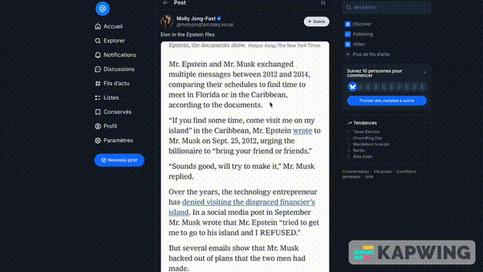
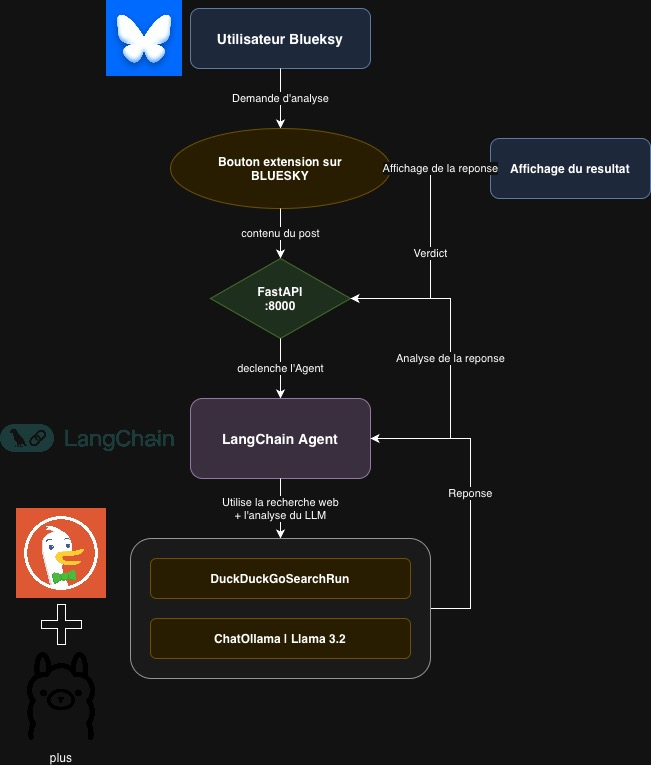

# Fake News Detector

Application de detection de fake news pour Bluesky utilisant un modele de langage (LLM) pour analyser le contenu des posts.

## Demo



*Exemple : analyse d'un post Bluesky sur un sujet d'actualite*

## Architecture



## Fonctionnalites

- Analyse du contenu via un modele LLM (Ollama avec LLaMA 3.2)
- Verification des faits via recherche web (DuckDuckGo)
- Interface web Streamlit
- Extension navigateur Chrome pour Bluesky

## Prerequis

- Docker et Docker Compose
- Git
- (Optionnel) Ollama installe localement pour l'extension Chrome

## Installation

```bash
git clone https://github.com/Thomas-Brvn/Social-Network-Fake-News-Detection.git
cd Social-Network-Fake-News-Detection
```

Avant le premier lancement, generez le fichier de lock :

```bash
pip install uv
uv lock
```

## Lancement

### Option 1 : Docker (recommande)

```bash
docker-compose up --build
```

L'interface web est accessible sur `http://localhost:8501`

Note : Le premier lancement telecharge le modele LLaMA 3.2 (~2 GB).

### Option 2 : Manuel

1. Installer et demarrer Ollama :
```bash
ollama serve
ollama pull llama3.2
```

2. Lancer l'application :
```bash
pip install -e .
streamlit run Analyseur_de_Tweet.py
```

## Extension Chrome

L'extension permet d'analyser les posts directement sur Bluesky.

### Installation de l'extension

1. Ouvrir Chrome et aller dans `chrome://extensions/`
2. Activer le "Mode developpeur"
3. Cliquer sur "Charger l'extension non empaquetee"
4. Selectionner le dossier `bluesky_fake_news_extension/`

### Lancement du serveur pour l'extension

L'extension necessite un serveur FastAPI separe :

```bash
# Demarrer Ollama (si pas deja fait)
ollama serve
ollama pull llama3.2

# Lancer le serveur FastAPI
cd bluesky_fake_news_extension
pip install fastapi uvicorn langchain-ollama langchain-community langgraph
uvicorn server:app --host 0.0.0.0 --port 8000
```

Le serveur de l'extension ecoute sur `http://localhost:8000`

## Stack technique

- Interface : Streamlit
- LLM : Ollama (LLaMA 3.2)
- Recherche web : DuckDuckGo
- Framework IA : LangChain, LangGraph
- API Bluesky : atproto
- Conteneurisation : Docker

## Licence

MIT
